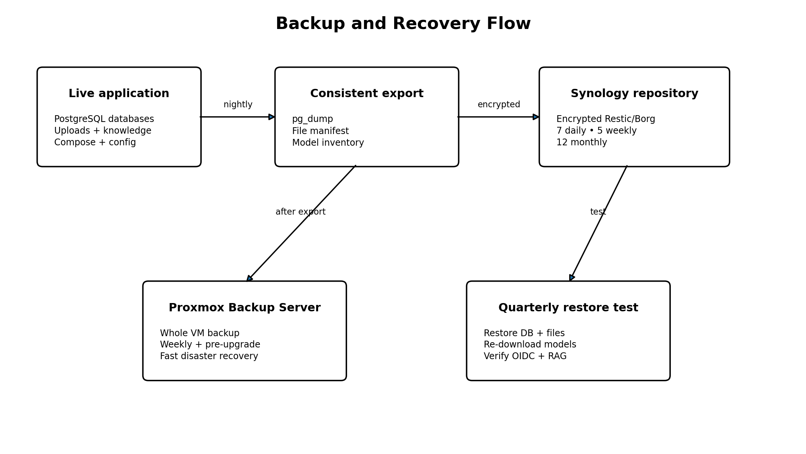

# Backup and restore



## Backup layers

### Nightly application backup

Back up:

- Open WebUI PostgreSQL database;
- Authentik PostgreSQL database;
- original knowledge documents;
- Open WebUI persistent files and vector data;
- Authentik media and configuration;
- Compose and Traefik configuration;
- encrypted `.env`;
- image/version inventory;
- Ollama model inventory.

Do not normally back up Ollama blobs.

### Weekly PBS backup

Back up the full VM after producing fresh database dumps. Also take a PBS backup before major upgrades.

## Retention

- 7 daily
- 5 weekly
- 12 monthly
- 4–8 weekly PBS restore points
- additional pre-upgrade restore point

## Backup execution

```bash
cd /opt/local-ai-appliance

# Run the application-consistent encrypted backup.
./backup/backup.sh
```

Schedule with systemd rather than cron where possible.

## Verification

A successful exit code is not enough.

```bash
# Check repository structure and stored data.
restic check

# List recent snapshots.
restic snapshots

# Inspect files inside the newest snapshot.
restic ls latest
```

## PostgreSQL restore

Start only PostgreSQL:

```bash
docker compose up -d postgres
```

Restore a database into a clean target:

```bash
# Drop and recreate only in an isolated restore environment.
docker exec -i ai-postgres dropdb -U postgres --if-exists openwebui
docker exec -i ai-postgres createdb -U postgres -O openwebui openwebui
cat openwebui.dump | docker exec -i ai-postgres \
  pg_restore -U postgres -d openwebui --clean --if-exists
```

Repeat for Authentik.

## Open WebUI data volume restore

Restore the Chroma vector store and browser-uploaded files from the tar archived by the backup script:

```bash
# Extract into a fresh openwebui_data volume.
docker run --rm \
  -v openwebui_data:/dest \
  -v "$(pwd)":/source \
  busybox tar -xzf /source/openwebui-data.tar.gz -C /dest
```

Run this before starting Open WebUI. The volume must exist (Docker creates it on `docker compose up -d postgres`).

## Full recovery order

1. Build an isolated replacement VM.
2. Install NVIDIA driver, Docker and NVIDIA Container Toolkit.
3. Restore repository and secrets.
4. Restore PostgreSQL.
5. Restore Open WebUI/AuthentiK volumes and knowledge source files.
6. Start the stack.
7. Re-pull models from `model-inventory.txt`.
8. Test OIDC.
9. Test both users.
10. Test private and shared knowledge.
11. Update internal DNS only after validation.

## Quarterly test

Record:

- date;
- backup snapshot;
- restore duration;
- database verification;
- login result;
- RBAC result;
- RAG result;
- issues and fixes.

A backup is not considered dependable until this test succeeds.
