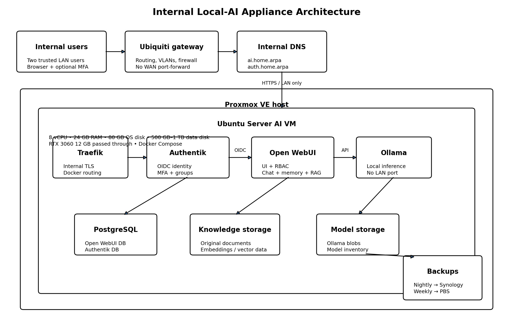

# Installation guide

> Target: internal-only local AI appliance on Proxmox, with Ubuntu Server, RTX 3060 passthrough, Traefik, Authentik, Open WebUI, Ollama and PostgreSQL.



## 1. Prerequisites

### Hardware

- Ryzen 5 5500
- RTX 3060 12 GB
- 32 GB RAM
- NVMe storage with at least 500 GB available
- IOMMU-capable motherboard/firmware

### Network

Choose names under a domain you control, for example:

```text
AI VM address: 192.168.1.63
Open WebUI:     ai.example.net
Authentik:      auth.example.net
```

Replace these examples everywhere in `.env`.

Configure local DNS overrides on the Ubiquiti gateway so both names resolve to the VM address for all LAN clients. Do not create public DNS records or WAN port forwards. See section 15 for the Ubiquiti DNS steps.

### Backups

Confirm:

- Synology backup destination is mounted or reachable;
- PBS datastore is healthy;
- you know where the encryption password will be stored.

## 2. Enable IOMMU on Proxmox

Enable SVM/IOMMU in firmware.

For an AMD host, add the IOMMU option to the Proxmox kernel command line. The exact file depends on whether the host uses GRUB or systemd-boot.

Example GRUB configuration:

```bash
# Edit the kernel command line.
sudo nano /etc/default/grub
```

Set:

```text
GRUB_CMDLINE_LINUX_DEFAULT="quiet amd_iommu=on iommu=pt"
```

Then:

```bash
# Rebuild boot configuration and reboot.
sudo update-grub
sudo update-initramfs -u -k all
sudo reboot
```

Verify:

```bash
dmesg | grep -Ei 'AMD-Vi|IOMMU'
find /sys/kernel/iommu_groups/ -type l
```

Check that the GPU and its HDMI audio function can be passed through safely. Do not continue if an IOMMU group contains host-critical devices that cannot be isolated.

## 3. Create the VM

Recommended Proxmox settings:

| Setting | Value |
|---|---|
| Name | `ai-server` |
| OS | Ubuntu Server 24.04 LTS |
| BIOS | OVMF |
| Machine | q35 |
| CPU type | host |
| vCPU | 8 |
| RAM | 24 GB |
| Ballooning | disabled |
| OS disk | 80 GB |
| Data disk | 500 GB–1 TB |
| NIC | VirtIO |
| QEMU guest agent | enabled |

Install Ubuntu before attaching the GPU if that is easier for console access.

Attach both GPU functions using PCI passthrough. Enable PCI-Express. Use the ROM-Bar/default settings first; change them only when troubleshooting requires it.

## 4. Prepare Ubuntu

Update the VM:

```bash
sudo apt update
sudo apt full-upgrade -y
sudo apt install -y qemu-guest-agent ca-certificates curl gnupg git jq openssl restic
sudo systemctl enable --now qemu-guest-agent
```

Set the host name and time zone:

```bash
sudo hostnamectl set-hostname ai-server
sudo timedatectl set-timezone Australia/Melbourne
```

Mount the second disk at `/opt` using its UUID in `/etc/fstab`.

Create the application path:

```bash
sudo mkdir -p /opt
sudo chown "$USER":"$USER" /opt
```

## 5. Install NVIDIA driver

Install an Ubuntu-supported production NVIDIA driver suitable for the installed Ubuntu release.

After reboot:

```bash
nvidia-smi
```

The RTX 3060 must appear without driver/library mismatch errors.

## 6. Install Docker Engine

Use Docker's official Ubuntu repository rather than Ubuntu's older `docker.io` package.

After installation:

```bash
sudo systemctl enable --now docker
sudo docker version
sudo docker compose version
```

Adding a user to the `docker` group grants root-equivalent control over the host. Use it only for trusted administrators.

## 7. Install NVIDIA Container Toolkit

Install the toolkit from NVIDIA's package repository, then configure Docker:

```bash
sudo nvidia-ctk runtime configure --runtime=docker
sudo systemctl restart docker
```

Test GPU access:

```bash
sudo docker run --rm --gpus all ubuntu:24.04 nvidia-smi
```

Do not continue until this succeeds.

## 8. Clone and configure the repository

```bash
cd /opt
git clone <YOUR_GITHUB_REPOSITORY_URL> local-ai-appliance
cd local-ai-appliance

cp .env.example .env
./scripts/generate-secrets.sh
chmod 600 .env
```

Edit:

```bash
nano .env
```

Set:

- `TRAEFIK_BIND_IP`
- `AI_FQDN`
- `AUTH_FQDN`
- `ACME_EMAIL` — email address for Let's Encrypt expiry notices
- `CF_DNS_API_TOKEN` — Cloudflare API token with Zone → DNS → Edit permission scoped to your zone
- tested image tags
- Authentik bootstrap email
- backup repository
- eventual OIDC client secret

## 9. Configure TLS via Let's Encrypt DNS-01

Traefik obtains and renews certificates automatically using the Let's Encrypt DNS-01 challenge against Cloudflare. No manual certificate files are needed.

### Create a Cloudflare API token

In the Cloudflare dashboard: My Profile → API Tokens → Create Token → **Edit zone DNS** template.

Scope the token to your zone only. Copy the token into `CF_DNS_API_TOKEN` in `.env`.

Set `ACME_EMAIL` to an address that can receive Let's Encrypt expiry notices (Traefik auto-renews, but this is a fallback contact).

### Configure Ubiquiti local DNS

Add local DNS overrides on the Ubiquiti gateway so that both FQDNs resolve to the VM LAN address for all clients on the network. Traffic never leaves the LAN; the Cloudflare API token is used only for the ACME challenge, not for routing.

See section 15 for the full Ubiquiti network policy steps.

### Verify

On first `docker compose up`, Traefik requests certificates from Let's Encrypt via Cloudflare DNS and stores them in the `traefik_acme` Docker volume. Check the Traefik log for `Obtaining` and `Certificate obtained` messages:

```bash
docker compose logs traefik | grep -i cert
```

Verify that browsers trust both internal names before configuring OIDC.

## 10. Validate the stack

```bash
./scripts/preflight.sh
docker compose config
```

Inspect published ports:

```bash
docker compose config | grep -A5 'ports:'
```

Only Traefik should publish ports.

## 11. Start PostgreSQL and Authentik

```bash
docker compose up -d postgres redis authentik-server authentik-worker traefik
docker compose ps
docker compose logs -f authentik-server
```

Open:

```text
https://auth.example.net
```

Complete the initial Authentik setup.

## 12. Configure Authentik

Create groups:

```text
ai-admins
ai-users
```

Add the owner to both groups and the second user to `ai-users`.

Create an OAuth2/OpenID provider and application:

| Setting | Value |
|---|---|
| Application name | Open WebUI |
| Slug | `open-webui` |
| Client type | Confidential |
| Redirect URI | `https://ai.example.net/oauth/oidc/callback` |
| Scopes | `openid email profile groups` |

Copy the client ID and secret into `.env`.

Confirm the discovery URL generated by Authentik and update `OPENID_PROVIDER_URL` where necessary.

### Add a groups scope mapping

Open WebUI reads the `groups` claim from the OIDC token to assign admin or user roles automatically. Authentik does not include group membership in tokens by default.

In Authentik: Customisation → Property Mappings → Create → Scope Mapping.

| Field | Value |
|---|---|
| Name | `groups` |
| Scope name | `groups` |
| Expression | `return [group.name for group in request.user.ak_groups.all()]` |

Add this mapping to the Open WebUI provider under **Advanced protocol settings → Scope mappings**.

### Restrict access

Restrict application access to the `ai-users` group. Authentik will deny login to anyone not in that group before Open WebUI is reached.

## 13. Start Ollama, Open WebUI, and voice services

```bash
docker compose up -d ollama faster-whisper kokoro open-webui
docker compose ps
```

Pull the coding model and the embedding model required by Mem0:

```bash
docker exec ollama ollama pull qwen2.5-coder:14b-instruct-q4_K_M
docker exec ollama ollama pull nomic-embed-text:latest
```

Optionally pull a general-purpose model as a fallback.

Kokoro downloads its voice models on first start (~5 GB image). Wait for the healthcheck to pass before testing TTS in Open WebUI.

Open:

```text
https://ai.example.net
```

Sign in through Authentik.

## 14. Configure Open WebUI

1. Confirm the owner account is administrator.
2. Confirm local uncontrolled signup is disabled.
3. Create or map groups for administrator and standard users.
4. Restrict models to approved groups.
5. Create:
   - `Shared Homelab Knowledge`
   - owner-private knowledge
   - second-user-private knowledge
6. Allow only the administrator to modify shared knowledge.
7. Enable personal memory carefully.
8. Test data separation using both accounts.

Do not store passwords, API keys or private keys in memory.

## 15. Apply network policy

### Ubiquiti firewall rules

- allow trusted LAN to AI VM TCP 443;
- allow admin network to SSH to AI VM;
- deny guest and IoT VLANs to AI VM;
- deny all WAN inbound traffic;
- allow outbound HTTPS (443) from AI VM for updates, model downloads and Let's Encrypt ACME API;
- allow outbound DNS (53/UDP) from AI VM to Cloudflare (`1.1.1.1`, `8.8.8.8`) for ACME propagation checks;
- allow backup traffic from AI VM to Synology.

Remove SSH access from general user networks.

### Ubiquiti local DNS overrides

In the Ubiquiti Network controller: Settings → Networks → DNS or Settings → Internet → DNS, add local DNS records:

```text
ai.example.net   → 192.168.1.63
auth.example.net → 192.168.1.63
```

Replace with your actual FQDNs and VM address. This ensures LAN clients resolve both names to the VM without going through public DNS.

## 16. Configure backups

Mount or configure the encrypted Restic repository.

Run:

```bash
./backup/backup.sh
restic snapshots
```

Create a systemd timer for nightly execution. Configure a weekly PBS VM backup after the application backup window.

## 17. Acceptance tests

### Infrastructure

```bash
docker compose ps
nvidia-smi
docker exec ollama ollama ps
```

### Security

- WAN cannot reach the VM.
- Guest/IoT VLANs cannot reach TCP 443.
- Ollama port 11434 is not reachable from another machine.
- PostgreSQL is not reachable from another machine.
- Browser trusts TLS.
- Traefik API and dashboard are disabled (`--api=false`).

### Identity and RBAC

- Both users authenticate through Authentik.
- MFA works for administrator.
- Standard user cannot open admin settings.
- Standard user sees only approved models.
- Each user cannot see the other's chats, memory or private knowledge.
- Both can read shared knowledge.

### Recovery

- Database dumps exist.
- `restic check` succeeds.
- PBS backup succeeds.
- A restore test date is scheduled.

## 18. Initial operating profile

```text
Model size:              7B–9B Q4
Context:                 32768
Loaded models:           1
Parallel generations:    1
Maximum human users:     2
STT:                     faster-whisper medium (CPU)
TTS:                     Kokoro 82M (CPU), default voice af_bella
```

Only increase these after measuring VRAM and responsiveness.

## 19. Upgrades

Before every meaningful upgrade:

```bash
./backup/backup.sh
```

Trigger a PBS backup, read upstream release notes, update pinned tags, and then:

```bash
./scripts/update.sh
```

Validate OIDC, RBAC, chats, memory and RAG after every upgrade.

## References

See [reference/SOURCES.md](reference/SOURCES.md). Upstream documentation is authoritative for current commands and environment variables.
